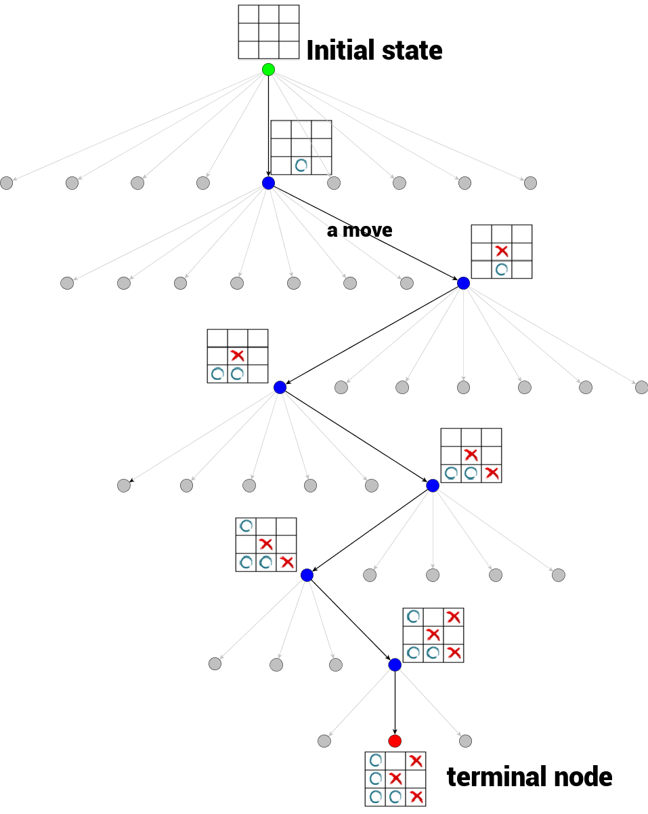
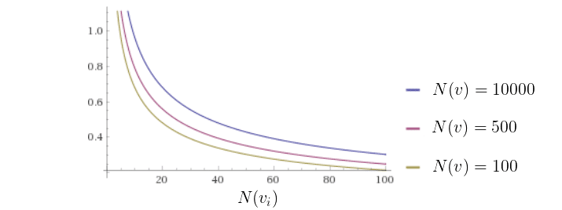

<!--more-->

# 蒙特卡罗树搜索 (Monte Carlo Tree Search)

## 介绍

蒙特卡洛树搜索通常用于双人有限序贯零和博弈游戏中，双人意味着这是属于两人（两个玩家）之间的博弈游戏，有限意味着每个玩家只有有限的可以采取的动作/行动，序贯意味着游戏是两个玩家轮流执行动作，零和表示两个玩家在游戏结束时的总收益之和为零，即一般情况下为一胜一败或者平局，一胜一败时胜者得分记为 + 1 而负者得分记为 -1 。

蒙特卡罗一词来源于摩纳哥的蒙特卡罗赌场，这表示该方法与概率统计有关，蒙特卡罗树搜索既然叫树搜索，那么肯定与搜索树有关，且是一种基于搜索的算法。蒙特卡罗树搜索方法便是通过对搜索树进行搜索，以得到的统计数据作为依据，提供一种概率上是最优的决策。

我们考虑简单的井字棋，我们希望能够在井字棋的博弈游戏中用上蒙特卡罗树搜索方法，我们已经知道该方法是基于树搜索的一种方法，那么我们需要构建一棵搜索树。我们以游戏的当前状态（例如：井字棋中，以棋盘作为当前状态）构建搜索树的节点，该节点的子节点便是基于当前状态，某位玩家采取某一行动能够到达的（所有）可能状态所确定的（所有）节点，如 [图1](#TicTacToeGameTree)。

 图1 井字棋的搜索树

在 [图1](#TicTacToeGameTree) 中，我们假设当前状态为游戏刚开始时，所有玩家均未落子，此时使用该状态构造一个根节点，根节点的子节点有九个，分别对应某一个玩家在棋盘上九个可能的落子处落子。蒙特卡洛树搜索便通过搜索的方法收集统计数据，然后选择最优的下一步，具体而言，包括：选择、展开、模拟、反向传播。

这里有几个问题需要回答：
- 蒙特卡罗树搜索方法收集什么统计数据？
- 什么是最优的下一步？
- 什么是选择？
- 什么是展开？
- 什么是模拟？
- 什么是反向传播？

下面不分先后地回答这些问题，当回答完这些问题，也就理解了蒙特卡罗树搜索方法。

这里先回答什么是模拟：首先按照某一规则选取某一个节点，然后通过采用一种能够模拟游戏双方采取的行动的叫做 rollout 的方法，模拟一次游戏，直至得出游戏结果：胜、败、和。如 [图1](#TicTacToeGameTree) 中，选取最上层的一个蓝色节点作为模拟开始的节点，然后不断采用 rollout 规则模拟一次游戏，直至最终到达 terminal node ，得到一次模拟下棋的游戏结果。因此，一次模拟必然能够得到一次游戏结果。那么，这里又衍生出几个问题：
- 我们采用什么规则来选取模拟开始的节点？
- 什么叫 rollout 方法？
- 模拟得到的游戏结果与统计数据有什么关系？

要回答以上问题，我们首先要知道蒙特卡洛树搜索方法中，将节点分成了两类（或者说是四类）：被访问的与被展开的。所谓被访问的节点就是模拟开始的节点，如上例中的第一个蓝色节点，在模拟结束之后就是一个被访问过的节点，否则就是未被访问的节点，应该注意的是，只有模拟开始的节点会被记录为被访问的节点，而其之后的所有节点（即通过rollout策略选择的节点，下文会说到 rollout 只用来选择时选择当前状态下要采取的行动）在本次模拟结束之后都不会被记录为被访问的。被展开的节点就是子节点被访问过的节点，如上例中，对应 [图1](#TicTacToeGameTree) 的绿色节点，在上例中模拟结束之后，由于它的一个子节点被标记为被访问过，因此该节点便会被标记为被展开，当该节点的所有子节点都被访问过，那么这个节点就是被完全展开的，否则就是不完全展开的。

那么什么是 rollout 策略呢？ rollout 实际上时一种用来快速选择移动的方法，通常是对可能的移动进行随机均匀采样，然后得到一个随机选取的移动的方法。实际上也可以根据实际情况，如游戏特点等，设计更合适的 rollout 策略。

当我们完成一次模拟，我们就会通过反向传播更新搜索树中的统计数据，那么搜索树中的统计数据到底是什么呢？实际上搜索树中的统计数据只有两个：节点 $v$ 的访问计数 $N(v)$ ，以及对于这个节点而言，从节点 $v$ 出发，能够得到的总收益 $Q(v)$ 。值得注意的是，我们在 [图1](#TicTacToeGameTree) 中看到的所有的节点并不都具有这两个统计数据，为什么呢？当完成一次模拟的时候，我们会对从根节点开始，至模拟开始的节点结束，这两个节点所确定的路径上的节点（包括根节点和模拟开始的节点）的统计数据进行更新，并不会更新模拟开始的节点之后的节点的数据，因此他们也就没有这些统计数据。需要被更新统计数据的节点（即，上述路径上所有的节点）都会更新这两个统计数据，我们很容易就知道访问计数的更新方式，那么总 $Q(v)$ 呢？这实际上可以根据具体情况设计不同的更新方式，最简单的就是将本次模拟所得的收益进行求和，如果模拟的结果为胜，那么 $Q(v) \leftarrow Q(v) + r$, 其中 $r$ 是本次模拟的收益，通常 $r \in \{-1, +1\}$。

收集这些统计数据不仅仅用来最后做决策，这些统计数据也帮助我们选择模拟开始的节点。最开始时，根节点没有一个子节点是被访问的，那么我们选择未被访问的子节点开始进行模拟，然后更新统计数据。那么如果根节点被完全展开了呢？这时候我们就可以使用统计数据来确定下一次要从哪一个节点开始进行模拟，此时选择的依据是 Upper Confidence Bound applied to Trees (UCT) , 如果我们记当前节点为 $v$ ，其某一个子节点为 $v_i$ ，那么我们可以将节点 $v$ 关于其子节点 $v_i$ 的 UCT 的值写成：

$UCT(v, v_i) = \frac{Q(v_i)}{N(v_i)}+c\sqrt{\frac{log(N(v))}{N(v_i)}}$

该式包含两个部分，第一部分衡量根据当前统计数据判断出来的子节点 $v_i$ 的优秀程度，但是我们不能仅靠第一项就作出决定，因为如果探索时，该节点不幸有某一些子节点节点正好都得到了以败作为结尾的模拟结果，此时仅采取第一项这种贪婪策略并不明智，因为这会导致一开始就探索到不好的结果的节点失去了后续被探索的可能性，而这些节点有可能提供更好的结果，因此引入了第二项，这一项实际上是探索项，它更偏重于探索次数少的节点，而探索次数多的节点由于其统计数据已经被比较全面地收集了，其探索的可能性便交由第一项确定。

<a name="UCTExploration">图2 UCT 探索项曲线</a>

[图2](#UCTExploration) 展示了子节点被探索的次数如何影响 UCT 的第二项(探索项)。

回到如何选择下一个要开始模拟的节点这一问题。当一个节点被完全展开了（即，其所有子节点都是被访问的），那么我们就计算该节点与其所有子节点的 UCT 值，然后选择 UCT 值最大的子节点。如果新选取的节点未被完全展开，那么那么我们就随机选择该新节点的一个未被访问的节点，作为模拟开始的节点，否则，就继续使用 UCT 选择新的节点，再继续判断。

从这一过程我们可以注意到：1) 每次模拟开始的节点都是未被访问过的，模拟结束之后模拟开始的点就会被标记为被访问过; 2) UCT 仅用来在子节点都是被访问过的情况下确定模拟开始的节点应该在哪一个子节点下，此时由于子节点是被访问过的，因此这里子节点不会被作为模拟开始的节点。

那么蒙特卡洛树搜索什么时候结束呢？请尽可能久地运行！由于蒙特卡罗树搜索是基于统计数据的，那么尽可能多地收集统计数据有利于我们作出更加准确的决策，因此我们可以在计算资源允许的情况下尽可能久地运行蒙特卡罗树搜索。

最后我们需要确定什么是最优的下一步：最优的下一步被认为跟访问次数有关，这里可以简单地选择访问次数最多的子节点作为最优的下一步。值得注意的是，虽然我们只需要确定根节点的哪一个子节点是最优的，但是我们会一直不断地展开节点（让节点变为被完全展开的）。

## 总结

我们正式回答一下上一小节提出的多个问题（有一些概念不会再重复回答）：

- 模拟：从一个未被访问过的节点开始，使用 rollout 策略模拟完成一局游戏；
- 选择：递归地选择一个被完全展开的节点，直到遇到一个未被完全展开的节点（该节点也被称为可展开的），选择该节点中的未被访问过的节点，递归过程中使用 UCT 值来确定如何找到该可以展开的节点（未被访问过的节点无法通过 UCT 值被选择），注意到，选择的过程中会生成一条路径，从根节点到该被选择的节点（也是模拟开始的节点）；
- 展开：让该节点的子节点被访问过，注意，被访问过要求以这个子节点为模拟开始的节点进行模拟；
- 反向传播：从模拟开始的节点开始，递归地往回更新统计数据，直到更新完根节点的统计数据；
- 最优的下一步：根据根节点的子节点中访问次数最多的节点；